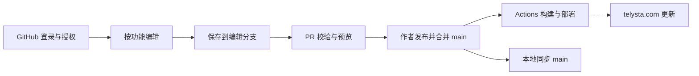

# 2026-09-13 云端与本地内容管理系统研判

> 2026-09-14 决策更新：作者接受本地优先，并已授权按完善后的计划继续执行。最新范围和进度见 [后台实施计划](admin-plan-2026-09-13.md)。本文保留技术比较，云端能力不是第一版前置条件；Hero 句库、标签页祝福与头像的具体字段以 [功能核对](feature-map.md) 为准。

本文是 2026-09-13 的技术研判，表中的云端能力均为建议，不是实现清单。2026-09-14 已按本地优先计划加入独立编辑器，见 [使用说明](local-admin.md)；未改变配置存储格式，也未修改 DNS、GitHub App、仓库权限或部署工作流。文件名保留，方便沿用已有链接。

## 结论

可以在 `https://telysta.com/telysta-admin/` 提供管理入口，使用 GitHub 登录，按功能编辑文案、问候语、导航链接、QQ／微信二维码和文章，并从云端发起发布。建议采用 **GitHub 保存内容和版本，后台提供编辑与发布界面，Actions 校验和部署** 的方案；公开博客继续静态展示。本地也能编辑同一批文件，通过 Git 同步。

“云端修改”可实现，但按这个方案，保存的是仓库源文件，必须构建、部署成功后才会更新网页，不是直接修改正在运行的 HTML。若要求保存后立即生效而完全不构建，则需要运行时 API／数据库或远程配置读取，会额外涉及缓存、SEO、可用性和数据同步，不建议作为当前第一版。

项目已有良好基础：`src/config` 集中了 15 个 TypeScript 配置文件，内容有 schema、元数据补全和独立校验脚本。当前缺少的是受控数据写入、云端认证、草稿发布流程和上传能力。后台不能保证任意输入都能构建，应做到错误输入不能覆盖有效配置、失败原因可读、失败版本不上线。

不能把所有 TypeScript 配置直接变成表单。现有文件混合了数据、类型、图片导入、派生值和回调函数；需要先区分哪些内容允许编辑，再为纯数据建立唯一来源和校验规则。后台不能只改变一份 JSON，而让网站继续读取另一份 TS 常量。

## 当前工程与可抽离范围

| 位置 | 内容 | 建议 |
| --- | --- | --- |
| `src/config/site.ts`、`pages/home.ts`、`pages/homeGreetings.ts`、`tabGreetings.ts` | 站点文案、导航、社交链接、问候语 | 优先纳入；校验 URL、必填项、长度、权重及唯一 ID |
| `pages/blog.ts`、`pages/resources.ts`、`pages/article.ts` | 界面文案，也包含派生字符串、占位符和阅读交互参数 | 只开放文案；保留占位符约束，交互参数先留在代码中 |
| `content/blogCategories.ts`、`content/blogSeries.ts` | 分类、系列、显示名称及关联关系 | 允许改名称和说明；既有 ID 与路由先锁定，避免断链 |
| `pages/homeProfiles.ts`、`visuals/categoryVisuals.ts` | 头像、卡片图、裁切参数和本地图片导入 | 后续通过受控图片标识选择；保留 TS 图片注册表与 URL 生成函数 |
| `content/resourceGallery.ts`、`content/resourceTypes.ts` | 展示资源、类型与状态契约 | 资源选择可做；类型枚举和业务规则不能随意改写 |
| `interactions/scroll.ts`、`interactions/siteChrome.ts`、`src/styles/global.scss` | 滚动函数、DOM 判断、动效与设计变量 | 不列入首期；禁止表单提交任意代码 |
| `src/content/weiser-posts`、资源内容目录 | Markdown 正文与 frontmatter | 可作为第二阶段；复用现有元数据补全与内容校验 |
| `src/generated`、`scripts` | CDN 清单、封面索引、谱面与资源生成流程 | 只显示结果或调用明确的受控命令，不手改生成文件 |

分类与系列的 TypeScript 字面量目前还参与类型推导和 schema 枚举。迁移为 JSON/YAML 时需要重建这个契约，不能靠类型断言掩盖错误。首页和页面配置中的派生值应继续由代码计算，不在表单中重复存储。

## 按功能划分管理菜单

后台面向作者显示功能名称，不要求作者先理解源代码目录。建议导航如下：

| 功能 | 可管理内容 | 约束 |
| --- | --- | --- |
| 站点设置 | 站点名称、SEO 描述、分享图、页脚文案 | 设置页只编辑字段，不删除整个配置文件；域名与构建参数作为高级维护项 |
| 首页内容 | 自我介绍、内容区块、排列顺序、显示开关 | 可添加既有区块类型；新增全新的交互区块仍需开发组件 |
| 问候语 | 新增、编辑、删除、搜索，语言／时段／权重等筛选 | 至少保留有效默认项，避免删空后随机选择失败 |
| 导航与联系方式 | 菜单、社交链接、标签、排序、QQ／微信二维码 | 链接协议白名单；从已有图标选择，新增图标类型需要代码支持 |
| 分类与角色展示 | 英文入口题签、花体角色名、中文展开介绍、图片与裁切 | 三种文案用途不同，分别标注预览；已有分类 ID 不随标题改名 |
| 系列管理 | 标题、介绍、所属分类、文章排序 | 删除前检查引用；顺序唯一，不能遗留孤立的系列序号 |
| 文章管理 | 搜索、筛选、新建、编辑、草稿、预览、发布、下线 | 默认草稿；日期、分类、系列、图片引用统一校验，保留原文章 URL |
| 媒体库 | 二维码、文章图片、角色展示图、资源图 | 区分用途和存储位置；显示被哪些内容引用，优先停用而非立即物理删除 |
| 发布与历史 | 修改差异、检查结果、部署进度、历史版本、恢复版本 | 恢复形成新的 Git 提交；不能把保存成功误报为部署成功 |

不是每个功能都适合任意增删：问候语和链接可以是列表，站点设置是单例；分类、系列、图片等被引用的数据必须先处理关联。这里的“后台配置化”针对受支持的内容模型，不是任意修改源码和执行代码。

## 同域名入口如何部署

已核对本地 `.github/workflows/deploy.yml`：只有 `main` 的 push 和手动触发，执行 `npm run check` 后发布 GitHub Pages，没有管理 API、PR 检查工作流或云端图片生成任务。GitHub Pages 本身是静态托管，不能承接认证密钥交换或服务端写入逻辑。[GitHub Pages 官方说明](https://docs.github.com/en/pages/getting-started-with-github-pages/what-is-github-pages)

可选落点有两种：

1. **静态管理页面＋独立认证／上传服务。** 例如 Decap 的管理页面放在 `/telysta-admin/`，随现有 Pages 发布；OAuth 和上传接口由外部服务提供。若接口也要在 `telysta.com` 下，可用 Cloudflare Worker 对管理 API 路径分流。前端页面在同域名，不代表认证服务也由 GitHub Pages 执行。
2. **独立的动态管理应用。** 例如 Keystatic 的管理界面与 API 部署在支持 Node.js 的服务，再把管理路径反向代理过去。公开博客仍保留现有发布方式。若整个网站迁移到支持动态 API 的托管平台，也可合并部署，但迁站不是实现后台的必要条件。

Cloudflare Workers Routes 支持在现有源站前按路径处理请求，前提是该主机名处于 Cloudflare 代理之下。仅仅正在使用 R2 不能证明 `telysta.com` 已满足此条件；本次没有访问账户核实 DNS、代理状态、套餐或路由。若以后采用分流，需要覆盖管理入口、子路径、资源及 OAuth 回调，测试斜杠跳转、刷新深层地址和 Cookie，认证响应不进入公共缓存。[Workers Routes 官方说明](https://developers.cloudflare.com/workers/configuration/routing/routes/)

`/telysta-admin/` 可以作为期望入口，但不能假设所有 CMS 只改一个路径就能工作：Keystatic 文档默认使用 `/keystatic`，其 API 和回调地址也需适配；先验证重定向或完整代理，不能只把页面文件夹改名。独立管理子域名是部署与隔离上的备选，并非本次已决定变更。

## GitHub 登录、权限与发布

GitHub 登录证明“是谁”，授权决定“能改什么”。应仅允许指定仓库的授权作者操作；如果使用应用自身的安装令牌写仓库，服务端还必须检查当前用户身份与权限，不能让任意 GitHub 用户借用应用的权限。隐藏后台网址不构成保护。

自行实现或选择支持它的方案时，优先使用只安装到本仓库的 GitHub App。拟定权限为内容读写、需要编辑分支流程时的 PR 读写，以及按需要读取检查／部署状态；不默认申请仓库管理、工作流修改或删除仓库权限。GitHub App 的仓库选择和细分权限优于传统 OAuth 的宽泛 scope；但 CMS 具体支持哪种认证方式必须按其实现确认。[GitHub App 与 OAuth App 的区别](https://docs.github.com/en/apps/oauth-apps/building-oauth-apps/differences-between-github-apps-and-oauth-apps)

仓库级内容权限也不等于“只能改文章目录”。自建写入 API 应再做路径和字段白名单，拒绝修改 `.github`、源码、依赖文件等；若 CMS 让浏览器直接调用 GitHub API，则表单限制不是文件权限隔离，适合当前可信作者，不能据此向陌生编辑开放。服务端机密不进入前端包；若采用浏览器持有用户访问令牌的现成方案，要明确其暴露面，不能声称令牌都只在服务端。

推荐发布流程如下（拟议流程，当前尚未实现）：



后台应区分“已保存”“检查失败／通过”“等待发布”“部署中”“已上线／部署失败”，并关联具体提交。保存草稿不应每次触发正式上线；建议一次发布提交一组相关配置，避免二维码文件和对应路径分两次上线。

当前工作流不会校验 PR；未来需新增仅检查、不部署的 PR 工作流，必要时提供独立预览，再设置主分支合并条件。GitHub Pages 不会凭空提供每个 PR 的预览地址。单人维护时可使用显式发布按钮，但仍应保留保存与发布的区别。还需确认仓库规则／套餐允许所选保护策略。

云端提交要实际触发当前 push 工作流。若用 Actions 的 `GITHUB_TOKEN` 再推送，不能假设会继续触发部署；GitHub 对这种触发有专门限制，应使用合适的 GitHub App／用户授权，或设计明确的手动事件衔接。[GitHub 的 GITHUB_TOKEN 触发规则](https://docs.github.com/en/actions/concepts/security/github_token)

## CMS 方案比较与优先级

| 方案 | 与本项目的适配 | 代价与限制 |
| --- | --- | --- |
| Decap CMS＋GitHub backend | 静态管理界面可与当前 Pages 共存；固定配置文件、文章集合、媒体字段和分支发布流程较贴近当前需要 | GitHub 登录仍需认证服务；通常走 OAuth，不能把 GitHub App 的权限优势算成其默认能力；嵌套文章目录、R2 和跨文件校验需要适配 |
| Keystatic GitHub mode | 已有 GitHub App 登录与仓库写权限判断；singletons 适合设置页，collections 适合文章，能选择分支 | 官方要求部署环境支持 API 所需的 Node.js；不能直接塞进纯 Pages。自定义管理路径、Astro 7／React 19 和主分支发布流程仍需实测 |
| TinaCMS | 有本地文件模式与云端 Git 内容编辑，适合更强的视觉编辑需求 | 增加其 schema、编辑与服务集成面；现阶段没有证据表明值得为少量配置管理承担这些改造 |
| 自建面板＋GitHub App 写入服务 | 最能定制功能分组、状态、受控路径和 R2 管线 | 登录会话、版本冲突、编辑器、文件往返、发布和安全都要自行维护，不建议第一步就全量自研 |

针对现在新增的“云端编辑＋继续使用 GitHub Pages”需求，**优先验证 Decap 的静态管理页面方案**；若更看重 GitHub App 权限方式与设置页体验，并愿意单独托管动态后台，则验证 Keystatic。这个优先级与此前只考虑本地模式时不同。先验证一个小范围的真实流程再选型，不同时维护两套 CMS，也不承诺现成插件能直接编辑所有 TS 配置。

能力依据：Decap 的 [GitHub backend](https://decapcms.org/docs/github-backend/) 要求用户具有仓库 push 权限；[File Collections](https://decapcms.org/docs/collection-file/) 对应固定配置文件，[Folder Collections](https://decapcms.org/docs/collection-folder/) 对应内容集合；[Editorial Workflow](https://decapcms.org/docs/editorial-workflows/) 将保存草稿和发布映射为编辑分支／PR 与合并。Keystatic 的 [GitHub mode](https://keystatic.com/docs/github-mode) 说明 GitHub App、写权限、分支选择和 Node.js 部署要求，[Singletons](https://keystatic.com/docs/singletons) 对应设置页；其 [Astro 接入指南](https://keystatic.com/docs/installation-astro) 仍需在本项目版本上验证。Tina 的本地与远程保存区别见 [开发者说明](https://tina.io/tinadocs/docs/using-tinacms/usage-developers)。

本次只读文档和检查工程，没有安装试验，不能把能力说明等同于项目已集成。认证服务的托管、GitHub／CMS 服务配额、预览存储、R2 请求与图片处理都会影响费用，应在选型试验时按实际账户核算，不作永久免费的承诺。

## 图片上传与二维码替换

现有图片有不同管线，后台必须沿用这些边界：

- **QQ／微信二维码：** `HOME_QR_CONTACTS` 位于 `src/config/pages/home.ts`，组件从 `src/assets/contact/*.{png,jpg,jpeg}` 导入图片。首期可上传受限尺寸的 PNG／JPEG 到这个目录，同时更新 `imageFileName`；图片与引用一次提交。仅填任意远程 URL 不会被当前组件识别。二维码上线前应预览并实际扫码，避免裁切／压缩损坏。
- **文章图片：** 普通图片可随文章写入 Git，由 Astro 构建处理，利于本地 `pull` 后直接使用。后台必须保留现有文章目录与相对路径，不能因为新建表单的 slug 规则移动老文章。大体积上传要限额，避免仓库无限膨胀。
- **角色卡片图：** 当前是本地 WebP 静态导入；先从已登记图片中选择，新增图片需要受控注册和优化流程，不能只把一个 URL 写入配置。
- **插画、头像及大资源：** 继续使用 R2。现有 `assets:prepare`、`assets:covers`、`assets:sync` 与生成清单是本地流程，普通部署不会替作者上传或生成这些资源；云端上传要另建管线，不能声称接入 CMS 后自动具备。

R2 的拟议流程是：作者授权 → 创建唯一上传对象／临时上传授权 → 上传到私有暂存区 → 服务端校验真实文件类型、大小与尺寸 → 生成展示图／封面 → 将已验证资源复制到不可变的公开路径 → 提交资源登记及文章引用 → 部署。失败时保留任务状态，清理孤立暂存对象。不要覆盖仍被旧版本引用的图片；撤销发布可恢复 Git 内容，但不会自动撤销 R2 写入。

浏览器直传可使用服务端签发的短期、限定对象的 PUT 预签名 URL；它用 R2 S3 API 域名，不能直接把 `assets.telysta.com` 当成预签名上传域名。跨域直传还需要配置 CORS。预签名 URL 在失效前可重复使用，不能称为一次性凭证；Content-Type 签名也不能代替服务端检查文件内容，图片处理应针对验证后的稳定对象。长期 R2 密钥只保存在服务端。[R2 预签名 URL](https://developers.cloudflare.com/r2/api/s3/presigned-urls/)、[浏览器 CORS](https://developers.cloudflare.com/r2/buckets/cors/)

## 本地与云端如何同步

发布后的内容以 GitHub `main` 为准，本地修改前先检查工作区，再同步：

```sh
git status
git pull --ff-only
```

这组命令适用于已在 `main` 且工作区干净的日常同步。已有本地修改时先提交到工作分支或暂存，不能自动覆盖；若本地与远程已分叉，`--ff-only` 会停止，需要检查差异后合并或 rebase，不能强推解决。云端尚未合并的草稿在编辑分支，不会因拉取 `main` 自动出现，需 fetch 后检出对应分支。

后台也要基于读到的提交／文件版本保存：版本变化后提示重新加载或合并，防止手机、电脑与 VS Code 相互覆盖。按当前单作者规模，Git 版本冲突处理足够，首期不需要实时协同编辑系统。

拉取只同步 Git 跟踪的文件和 R2 资源登记，不会下载仓库外的原始素材。若后台上传了新的 R2 原图，本地重新生成清单之前必须同步这些原图，或改造清单生成器以云端资源登记为准；否则旧的本地素材目录可能生成缺项清单。必须明确原图与资源登记的唯一来源，不能把一次 `pull` 误当作全部资源同步。

## 主要风险及对策

1. **草稿保密，优先级高。** 调查时可匿名访问的 [仓库页面](https://github.com/weiserTelysta/TelystaBlog) 标记为 Public。公开仓库的编辑分支、PR 和历史记录不适合保存私密正文；`draft: true` 只控制博客展示。若需要保密草稿，应使用私有内容仓库／私有草稿存储，再设计授权构建和发布；这会增加集成范围，需先决定。管理入口登录不能改变仓库与已公开 R2 对象的可见性。
2. **权限及同源攻击，优先级高。** 校验 OAuth state、回调地址、登录会话和每次写入权限；会话方案应使用安全 Cookie 并按所选 CMS 核实 CSRF 防护。预览 Markdown／HTML 时隔离或清洗脚本，限制链接协议与上传类型。同域名的博客与后台共享 origin，Cookie Path 不能当作安全边界；独立管理子域名可作为更强隔离的备选。密钥放服务端密钥存储，禁止写入 Git、页面脚本和日志。
3. **覆盖修改与内容往返，优先级高。** 云端比对 Git 版本，本地比对内容哈希；版本冲突后保留作者改动，禁止静默覆盖。用真实文章验证 YAML 注释、未知字段、数学公式、谱面、代码块和相对图片路径不会被编辑器重排破坏。原始 Markdown 编辑应保留为可用模式。
4. **损坏配置、断链或误发布，优先级高。** 新建文章明确写 `draft: true`，同时区分有效推导值与作者填写值；ID 改名或删除先检查引用。复用内容校验，补充公开配置的 schema 与跨文件约束，检查失败不合并上线；前端表单校验不能代替 CI。当前文章路径包含中文、非补零日期、嵌套目录和 `Notes` 大小写，迁移测试必须覆盖。
5. **上传与部署不一致，优先级中高。** Git、R2 与部署不是一个事务；为图片处理、提交和发布分别记录状态并允许重试。只引用已处理成功的不可变对象，资源删除前查引用并保留恢复窗口。普通构建不应持有资源写入密钥；需要图片处理任务时独立限定权限。
6. **后台故障与维护，优先级中。** 独立后台故障不应让公开博客下线；损坏内容不应阻止打开编辑修复界面。本地模式仍需回环绑定、来源校验和真实路径白名单。后台版本与数据 schema 不兼容时应拒绝写入，部署与依赖更新需有回归和回退方式。若使用独立动态后台，其接口存在于线上是预期行为，应保护接口，而非沿用“生产环境一律不得有后台”的旧本地方案要求。

## 云端方案的建议顺序（尚未执行；本地阶段另见实施计划）

1. **确定边界。** 确认只供作者使用还是多作者、草稿是否必须私密、同域路径与代理条件、希望使用的托管方式。保留 Git 为内容版本来源；先不引入独立内容数据库。
2. **隔离验证。** 用测试分支／测试内容验证登录、未授权拒绝、一个站点设置、一条问候语、一篇包含本项目语法的 Markdown、一张二维码。优先验证 Decap 与 Pages 共存，必要时比较 Keystatic 独立动态部署；不直接迁移全部内容。
3. **配置与普通文章第一版。** 只迁移经 schema 验证的纯数据；提供上述功能分组、草稿保存、修改差异、版本冲突、PR 检查和显式发布。确认 GitHub 事件能触发部署、失败时线上保留上一版、本地拉取可复现。
4. **R2 媒体库第二版。** 独立实现授权上传、图片处理、资源登记、引用检查、原图同步与任务恢复。先提供已登记资源选择，再开放新增和停用，不做任意目录的删除／同步按钮。

首期验收应包括：未授权用户无法读取私有草稿或写入；保存后仓库确有对应版本；发布部署后网站读取新值；非法输入和旧版本保存无法覆盖有效数据；删除被引用内容被阻止；管理界面在内容错误时仍可修复；日志和静态产物没有机密；真实文章能无损往返；本地与 CI 一致通过。

本轮结论是架构可行、存在可复用 CMS，不是后台已经建成。尚未核实账户级 DNS／路由配置、分支保护策略和实际托管成本，也没有验证 CMS 与当前 Astro 7／React 19 的集成，这些是未来试验的明确检查项。
