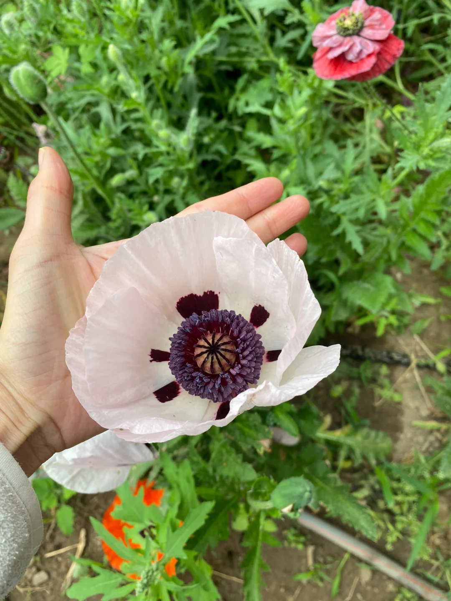

神戸新一様

こんにちは。
以前より神戸新一様の画風がとても好きで、キャラクターや作品全体の雰囲気を形にされる力にも大変魅力を感じております。
このたび、私のオリジナル世界観に登場する一人のキャラクターについて、イラストを制作していただきたく、ご連絡いたしました。

彼女は十七歳ほどの人間の女性で、戦争孤児です。
幼い頃から「火と戦争の神」を信仰する宗教教団に育てられました。

この教団の者たちは、戦場において神聖な従者として活動し、死者を弔い、戦争の中で安らぐことのできない魂を慰める役割を担っています。
また、平時には戦争孤児や寡婦たちの世話をしています。

この教団では、魂の最後の願いを叶えることでその魂と契約を結びます。
そして契約を結んだ魂は、戦いの際に彼らを助ける「霊の伴侶」のような存在となります。

今回お願いしたいキャラクターについてですが、彼女は亜麻色の髪と灰青色の瞳を持っています。

性格は、優しく母性的でありながら、同時にとても芯の強い人物です。
彼女は弱い者にとっての避難所のような温かさを持ち、人を安心させる雰囲気があります。
しかし、戦場を生き抜いてきた過去があるため、内面には決して折れない意志と強さも備えています。
彼女は善良ですが、決して脆い人物ではありません。

彼女を象徴する花は、白いオリエンタルポピーです。

現在のイメージとして、彼女の服装はアルメニア・キリスト教風の宗教服を主な参考にしています。
また、顔に着ける儀式用の面具は、ゾロアスター教の「Padan」面具を参考にしています。

彼女の役割には戦場で遺体を扱うことも含まれるため、香り袋やポマンダーのようなものを携帯しています。
また、ローブの下には、没薬、乳香、松脂などの香料を入れた小袋や、火に関する儀式に使う小瓶の油を持っています。

今回は、彼女を描いた一枚の場面イラストをお願いできればと思っております。
衣装については、宗教性や儀式的な雰囲気を残しつつ、中世の一般民衆が身につけていたような実用的な服装に近づけていただけますと幸いです。
彼女の出自や教団の使命に合うよう、あまり華美ではなく、素朴で丈夫でありながら、どこか神聖さがあり、少女らしさも感じられる雰囲気を希望しております。

服装の細部、髪型、構図、全体の雰囲気などについては、神戸新一様のご判断にお任せいたします。
どのようにこのキャラクターを解釈していただけるのか、とても楽しみにしております。

もし依頼内容、作業量、または金額について調整が必要な点がございましたら、どうぞ遠慮なくお知らせください。
ご検討いただけますと幸いです。

どうぞよろしくお願いいたします。

## 参考画像

